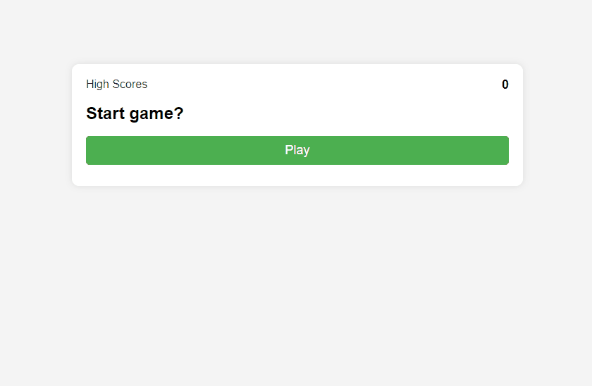

# Trivia Game

## Table of Contents
- [Description](#description)
- [Files](#files)
- [Requirements](#requirements)
- [Installation](#installation)
- [Usage](#usage)
- [Live Site](#live-site)
- [Preview](#preview)

## Description
This is a simple trivia game where users can answer multiple-choice questions. The game keeps track of scores and allows users to save their high scores.

## Files
- `index.html`: Main HTML file for the game interface.
- `highscores.html`: HTML file for displaying high scores.
- `style.css`: CSS file for styling the game interface.
- `script.js`: JavaScript file containing the game logic.
- `scores.js`: JavaScript file for displaying high scores.

## Requirements
- Web browser with JavaScript enabled.

## Installation
1. Clone the repository to your local machine:

   ```bash
   git clone https://github.com/chiiives/coding-quiz.git

2. Navigate to the project directory.

## Usage
1. Open `index.html` in a web browser.
2. Start playing the trivia game by clicking on the "Play" button.
3. Answer the multiple-choice questions within the time limit.
4. At the end of the game, enter your initials and submit your score.
5. View high scores by clicking on the "High Scores" link.

## Live Site
The live site can be accessed [here](https://chiiives.github.io/coding-quiz/).

## Preview


---

Application is developed by Jordan.

[](LICENSE)